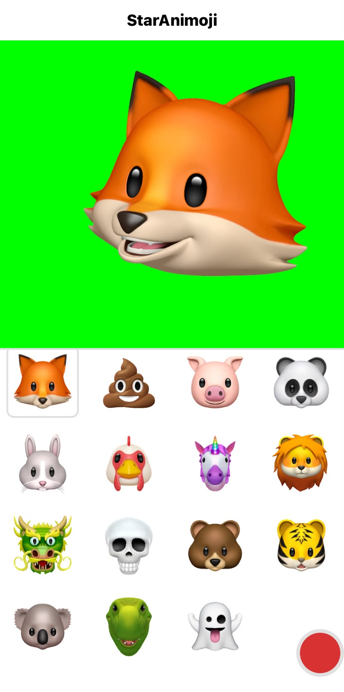

# StarAnimoji

Simple animoji setup with a greenscreen for better editing experience when using Animoji's in videos!

### What you get

- Animoji preview on a greenscreen for better editing.
- Record Animoji videos of up to 60 seconds.
- An example of how to use Apples AvatarKit.

### What you don't get

- Error handling. Should you encounter an error, try restarting the app.
- Fully built IPA File. (You can build this app by yourself and add it to your iPhone via [Sideloadly](https://sideloadly.io/))

# Notice

This app is only supported on iPhones that have "TrueDepth" cameras and Memoji/Animoji support.

This project relies heavily on Apples private API and you should therefore not try to submit this code to App Store.

## This is heavily based/worked off [Simon B.](https://github.com/simonbs)'s [SBSAnimoji](https://github.com/simonbs/SBSAnimoji) go check it out!

